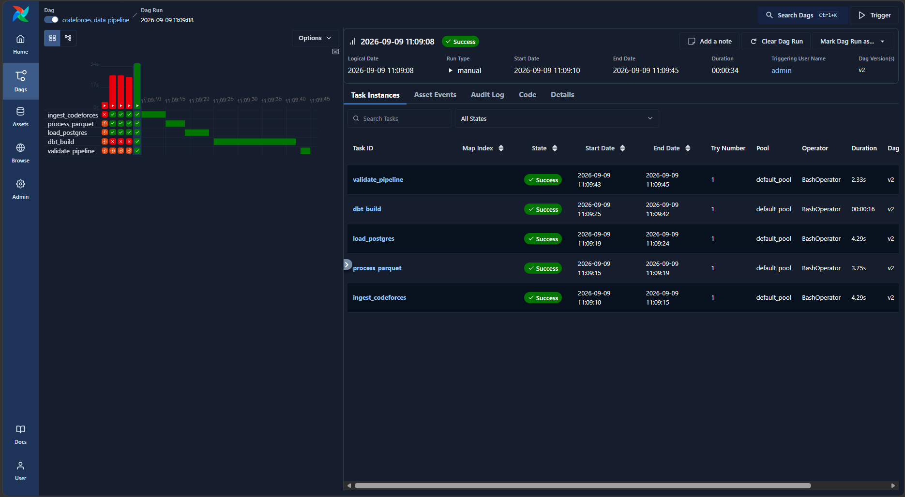
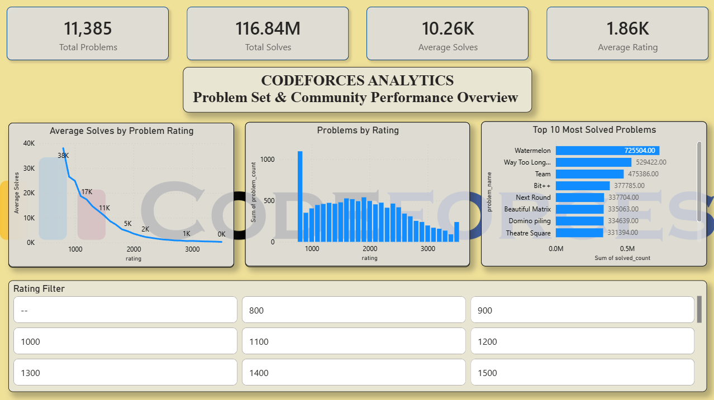
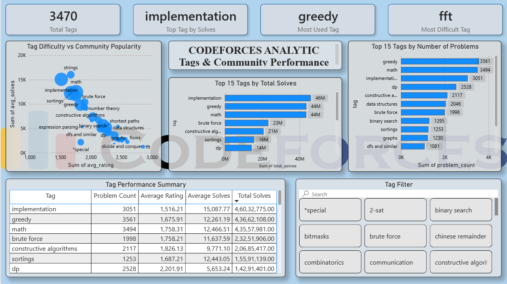

# Codeforces Data Lakehouse

An end-to-end data engineering and analytics project that transforms Codeforces problem-set data into a structured analytical warehouse and interactive Power BI dashboards.

The project demonstrates a complete modern data pipeline:

Codeforces API
      │
      ▼
Python Ingestion
      │
      ▼
Raw Data
      │
      ▼
Parquet Processing
      │
      ▼
PostgreSQL Data Warehouse
      │
      ▼
dbt Transformations
      │
      ▼
Analytics Marts
      │
      ▼
Power BI Dashboards


---

## Project Overview

The goal of this project is to build a production-style data pipeline around Codeforces programming-problem data.

Instead of directly connecting a dashboard to raw API data, the project follows a layered architecture where data is:

1. Extracted from Codeforces
2. Stored in a raw/intermediate format
3. Processed using Python
4. Loaded into PostgreSQL
5. Transformed using dbt
6. Validated through automated checks
7. Orchestrated using Apache Airflow
8. Visualized using Power BI

This provides an end-to-end demonstration of data engineering concepts including:

- API data ingestion
- Data cleaning
- Parquet-based data processing
- PostgreSQL warehousing
- SQL transformations
- dbt modeling
- Data quality validation
- Workflow orchestration
- Docker containerization
- Business intelligence
- Interactive analytics


---

## Objectives

The main objectives of this project are:

- Build a reproducible Codeforces data pipeline
- Automate ingestion and transformation workflows
- Store structured analytical data in PostgreSQL
- Use dbt to create reusable analytical models
- Implement pipeline validation
- Orchestrate the complete workflow using Airflow
- Build an interactive Power BI analytics layer
- Analyze problem difficulty, popularity, ratings, and programming tags
- Demonstrate practical data engineering architecture


---

## Complete Architecture Diagram

```mermaid
flowchart LR

    %% =========================
    %% Source Layer
    %% =========================
    subgraph Source["🌐 Source Layer"]
        CF["🏆 Codeforces API<br/>Problemset API"]
    end

    %% =========================
    %% Ingestion Layer
    %% =========================
    subgraph Ingestion["🐍 Ingestion Layer"]
        INGEST["🐍 Python<br/>ingest_problemset.py"]
    end

    %% =========================
    %% Data Lake Layer
    %% =========================
    subgraph Lake["🗄 Data Lake Layer"]
        RAW["📦 Raw Data<br/>JSON / Parquet"]
        PROCESSED["⚙️ Processed Data<br/>Parquet"]
    end

    %% =========================
    %% Warehouse Layer
    %% =========================
    subgraph Warehouse["🐘 Data Warehouse Layer"]
        PG["🐘 PostgreSQL 16<br/>Codeforces Warehouse"]

        RAW_SCHEMA["📥 Raw / Staging<br/>Codeforces Data"]
    end

    %% =========================
    %% Transformation Layer
    %% =========================
    subgraph Transformation["🔄 Transformation Layer"]
        DBT["🔷 dbt<br/>Analytics Transformations"]

        MARTS["📊 Analytics Marts<br/>Problem Performance<br/>Rating Summary<br/>Tag Performance"]
    end

    %% =========================
    %% Orchestration Layer
    %% =========================
    subgraph Orchestration["⚙️ Orchestration Layer"]
        AIRFLOW["🌬 Apache Airflow<br/>Daily Pipeline"]
    end

    %% =========================
    %% Visualization Layer
    %% =========================
    subgraph Visualization["📈 Visualization Layer"]
        PBI["📊 Power BI<br/>Interactive Dashboards"]
    end

    %% =========================
    %% Developer / Monitoring Tools
    %% =========================
    subgraph DevTools["🛠 Development & Monitoring"]
        DOCKER["🐳 Docker<br/>Containerized Services"]
        PGADMIN["🗃 pgAdmin<br/>PostgreSQL Management"]
    end


    %% =========================
    %% Main Data Flow
    %% =========================

    CF -- "REST API Request" --> INGEST

    INGEST -- "Raw Dataset" --> RAW

    RAW -- "Read & Process" --> PROCESSED

    PROCESSED -- "Load Data" --> PG

    PG --> RAW_SCHEMA

    RAW_SCHEMA -- "dbt Models" --> DBT

    DBT -- "Build" --> MARTS

    MARTS --> PG

    PG -- "DirectQuery / Import" --> PBI


    %% =========================
    %% Airflow Orchestration
    %% =========================

    AIRFLOW -. "1. Ingest" .-> INGEST
    AIRFLOW -. "2. Process" .-> PROCESSED
    AIRFLOW -. "3. Load" .-> PG
    AIRFLOW -. "4. dbt Build" .-> DBT
    AIRFLOW -. "5. Validate" .-> MARTS


    %% =========================
    %% Infrastructure
    %% =========================

    DOCKER -. "Runs Services" .-> AIRFLOW
    DOCKER -. "Runs Database" .-> PG
    DOCKER -. "Runs Tools" .-> PGADMIN

    PG -. "Database Management" .-> PGADMIN


    %% =========================
    %% Styling
    %% =========================

    style Source fill:#1a1a2e,stroke:#00b4d8,color:#fff
    style Ingestion fill:#1a1a2e,stroke:#3776ab,color:#fff
    style Lake fill:#1a1a2e,stroke:#f4a261,color:#fff
    style Warehouse fill:#1a1a2e,stroke:#4169e1,color:#fff
    style Transformation fill:#1a1a2e,stroke:#4c6ef5,color:#fff
    style Orchestration fill:#1a1a2e,stroke:#7b2cbf,color:#fff
    style Visualization fill:#1a1a2e,stroke:#f2c811,color:#fff
    style DevTools fill:#1a1a2e,stroke:#888,color:#fff

    style CF fill:#0d1b2a,stroke:#00b4d8,color:#fff
    style INGEST fill:#0d1b2a,stroke:#3776ab,color:#fff
    style RAW fill:#0d1b2a,stroke:#f4a261,color:#fff
    style PROCESSED fill:#0d1b2a,stroke:#f4a261,color:#fff
    style PG fill:#0d1b2a,stroke:#4169e1,color:#fff
    style DBT fill:#0d1b2a,stroke:#4c6ef5,color:#fff
    style MARTS fill:#0d1b2a,stroke:#4c6ef5,color:#fff
    style AIRFLOW fill:#0d1b2a,stroke:#7b2cbf,color:#fff
    style PBI fill:#0d1b2a,stroke:#f2c811,color:#fff
    style DOCKER fill:#0d1b2a,stroke:#2496ed,color:#fff
    style PGADMIN fill:#0d1b2a,stroke:#888,color:#fff
```


---

## Technology Stack

| Technology     | Purpose                                    |
| -------------- | ------------------------------------------ |
| Python         | Data ingestion, processing and validation  |
| PostgreSQL     | Analytical data warehouse                  |
| Apache Airflow | Pipeline orchestration                     |
| dbt            | SQL transformations and data modeling      |
| Parquet        | Efficient intermediate data storage        |
| Docker         | Containerized development environment      |
| Power BI       | Interactive dashboards and visualization   |
| SQL            | Data transformation and analytical queries |
| Git / GitHub   | Version control                            |

---

## Project Structure

```text
codeforces-data-lakehouse/
│
├── airflow/
│   ├── dags/
│   │   └── codeforces_pipeline.py
│   │
│   ├── logs/
│   │
│   ├── plugins/
│   │
│   └── Dockerfile
│
├── dbt/
│   └── codeforces_warehouse/
│       │
│       ├── models/
│       │   ├── staging/
│       │   │
│       │   └── marts/
│       │       ├── mart_problem_performance.sql
│       │       ├── mart_rating_summary.sql
│       │       └── mart_tag_performance.sql
│       │
│       ├── dbt_project.yml
│       ├── profiles.yml
│       └── target/
│
├── scripts/
│   ├── ingest_problemset.py
│   ├── process_problemset.py
│   ├── load_postgres.py
│   └── validate_pipeline.py
│
├── src/
│   └── ...
│
├── data/
│   ├── raw/
│   ├── processed/
│   └── ...
│
├── docker-compose.yml
├── requirements.txt
├── .gitignore
└── README.md
```

> Directory names may evolve as the project develops. The main architectural components remain the same.

---

# Output

> 

> 

> 


# Data Pipeline

The pipeline is orchestrated through an Apache Airflow DAG named:

```text
codeforces_data_pipeline
```

The DAG executes the following tasks sequentially:

```text
ingest_codeforces
        ↓
process_parquet
        ↓
load_postgres
        ↓
dbt_build
        ↓
validate_pipeline
```

The current DAG is configured with:

```text
Schedule: 0 2 * * *
Catchup:  False
Executor: LocalExecutor
```

The Airflow DAG uses `BashOperator` tasks to execute the Python scripts and dbt commands inside the Airflow environment.  

---

# 1️⃣ Data Ingestion

The ingestion layer retrieves Codeforces problem-set data and stores the raw dataset for further processing.

Main script:

```text
scripts/ingest_problemset.py
```

Airflow task:

```text
ingest_codeforces
```

The ingestion task runs the Python ingestion script from the project directory. 

### Responsibilities

* Retrieve Codeforces problem data
* Capture problem metadata
* Preserve raw information
* Provide input for downstream processing

---

# 2️⃣ Data Processing

The processing stage converts the raw dataset into a cleaner and more efficient analytical format.

Main script:

```text
scripts/process_problemset.py
```

Airflow task:

```text
process_parquet
```

The processing task is executed after ingestion and before loading into PostgreSQL. 

### Responsibilities

* Clean raw fields
* Normalize data
* Prepare structured records
* Generate processed Parquet data
* Prepare data for warehouse loading

---

# 3️⃣ PostgreSQL Data Warehouse

Processed data is loaded into PostgreSQL.

Database:

```text
codeforces_dw
```

The PostgreSQL warehouse runs in Docker using PostgreSQL 16. The database container exposes port `5434` on the host while PostgreSQL itself listens on port `5432` inside the container. 

### Warehouse responsibilities

* Persist processed Codeforces data
* Provide SQL-based analytical access
* Serve as the source for dbt transformations
* Provide the final analytical layer for Power BI

---

# 4️⃣ dbt Transformation Layer

dbt is used to transform warehouse data into analytics-ready models.

Project:

```text
dbt/codeforces_warehouse
```

The Airflow pipeline executes:

```bash
dbt build --project-dir dbt/codeforces_warehouse
```

after PostgreSQL loading is complete. 

### dbt responsibilities

* Transform warehouse data
* Create analytical models
* Standardize business logic
* Produce reusable marts
* Provide a clean data layer for BI

---

# Analytics Data Models

The project currently contains analytical marts focused on three major areas.

## `mart_problem_performance`

Problem-level analytical model.

Key fields include:

```text
contest_id
problem_index
problem_key
problem_name
problem_type
rating
solved_count
tags
```

This model powers problem-level analysis and the Problem Explorer dashboard.

---

## `mart_rating_summary`

Rating-level aggregation.

Important metrics include:

```text
rating
problem_count
total_solves
avg_solves
min_solves
max_solves
```

This model is used to analyze how problem difficulty relates to community solving behavior.

---

## `mart_tag_performance`

Tag-level analytical model.

Important metrics include:

```text
tag
problem_count
total_solves
avg_solves
avg_rating
```

This model is used to analyze programming concepts and their popularity within the Codeforces problem set.

The tag transformation separates tags from the problem-level dataset and aggregates them into tag-level performance metrics.

---

# Data Cleaning

One important part of the project is handling Codeforces problem tags.

Raw tag values can contain inconsistent formatting such as:

```text
"math"
["math"]
["greedy"
"greedy"]
["binary search"
```

The analytical tag layer therefore normalizes tag values before aggregation.

The goal is to make Power BI slicers and visualizations show clean values such as:

```text
math
greedy
dp
graphs
implementation
binary search
data structures
```

rather than multiple representations of the same logical tag.

---

# 5️⃣ Data Validation

The pipeline includes a validation stage:

```text
scripts/validate_pipeline.py
```

Airflow task:

```text
validate_pipeline
```

Validation runs only after the dbt transformation stage has completed successfully. 

The validation layer is intended to catch issues such as:

* Missing data
* Empty datasets
* Unexpected row counts
* Warehouse loading failures
* Transformation failures
* Data consistency problems

---

# 6️⃣ Apache Airflow

Apache Airflow is used as the orchestration layer.

DAG:

```text
codeforces_data_pipeline
```

Current workflow:

```text
┌─────────────────────┐
│ ingest_codeforces   │
└──────────┬──────────┘
           ↓
┌─────────────────────┐
│ process_parquet     │
└──────────┬──────────┘
           ↓
┌─────────────────────┐
│ load_postgres       │
└──────────┬──────────┘
           ↓
┌─────────────────────┐
│ dbt_build           │
└──────────┬──────────┘
           ↓
┌─────────────────────┐
│ validate_pipeline   │
└─────────────────────┘
```

The DAG is configured to run daily and does not perform historical catch-up runs. 

### Airflow components

The Docker environment includes:

* Airflow API Server
* Airflow Scheduler
* Airflow DAG Processor
* Airflow Triggerer
* Airflow Metadata PostgreSQL database

The Airflow services use `LocalExecutor`, while a separate PostgreSQL service is used as the Airflow metadata database.  

---

# 🐳 Docker Architecture

Docker Compose is used to run the local development environment.

Main services:

```text
postgres
airflow-postgres
airflow-apiserver
airflow-scheduler
airflow-dag-processor
airflow-triggerer
```

The Codeforces warehouse PostgreSQL database and Airflow metadata database are intentionally separated. 

The project directory is mounted into the Airflow containers at:

```text
/opt/airflow/project
```

This allows Airflow tasks to execute the project scripts and dbt project directly. 

---

# Power BI Analytics

The final analytical layer is consumed by Power BI.

The dashboard is designed as a multi-page Codeforces analytics application.

---

## Page 1 — Codeforces Overview

### Purpose

Provides a high-level overview of the Codeforces problem ecosystem.

### Key KPIs

* Total Problems
* Total Solves
* Average Solves
* Average Rating

### Main visuals

* Average Solves by Problem Rating
* Problems by Rating
* Top 10 Most Solved Problems
* Rating filter

This page answers questions such as:

* How many problems are available?
* Which rating ranges contain the most problems?
* Which problems are solved the most?
* How does solving activity change with difficulty?

---

# Page 2 — Tags & Community Performance

### Purpose

Analyze programming tags and their relationship with community behavior.

### KPI Cards

* Total Tags
* Top Tag by Solves
* Most Used Tag
* Most Difficult Tag

### Main visuals

* Tag Difficulty vs Community Popularity
* Top 15 Tags by Total Solves
* Top 15 Tags by Number of Problems
* Tag Performance Summary
* Tag Filter

### Example analytical questions

* Which programming concepts appear most frequently?
* Which tags receive the highest number of solves?
* Which tags have the highest average difficulty?
* Which concepts are popular despite being difficult?
* How does tag popularity relate to problem difficulty?

---

# Page 3 — Problem Explorer

### Purpose

Provide detailed problem-level exploration.

### Planned components

#### KPI Cards

* Total Problems
* Most Solved Problem
* Hardest Problem
* Average Rating

#### Filters

* Problem Name
* Rating
* Problem Type
* Contest ID

#### Main Table

The Problem Explorer table contains:

```text
Problem Name
Contest ID
Problem Index
Problem Type
Rating
Solved Count
Tags
```

#### Visualizations

* Top 10 Most Solved Problems
* Problem Difficulty vs Solves

This page allows users to move from high-level analytics into individual Codeforces problems.

---

# 🔎 Key Analytical Questions

The dashboard is designed to answer questions such as:

### Problem Difficulty

* How many problems exist at each rating?
* What rating range contains the most problems?
* How does average solving activity change as difficulty increases?

### Community Behavior

* Which problems are solved the most?
* Are easier problems significantly more popular?
* Which difficult problems still attract a large number of solves?

### Tags

* Which programming concepts are most common?
* Which tags generate the most total solves?
* Which tags have the highest average rating?
* Which tags combine high difficulty with high community interest?

### Problem Exploration

* What are the most solved individual problems?
* What rating does a particular problem have?
* Which tags are associated with a problem?
* How does a problem compare with others at similar difficulty?

---

#  Data Engineering Concepts Demonstrated

This project demonstrates practical implementation of:

### ETL / ELT

```text
Extract → Transform → Load
```

and:

```text
Load → Transform
```

through the PostgreSQL + dbt architecture.

### Data Lakehouse Concepts

* Raw data
* Processed Parquet data
* Analytical warehouse
* Transformation layer
* BI consumption layer

### Data Warehousing

* PostgreSQL
* Analytical marts
* Aggregations
* Dimensional-style analytical modeling

### Workflow Orchestration

* Apache Airflow
* DAG dependencies
* Scheduled execution
* Task-level monitoring
* Failure handling

### Data Transformation

* SQL
* dbt models
* Aggregations
* Tag normalization
* Analytical metrics

### Containerization

* Docker
* Docker Compose
* Isolated PostgreSQL services
* Containerized Airflow environment

---

# Getting Started

## Prerequisites

Install:

* Docker Desktop
* Git
* Python 3.12+
* Power BI Desktop

Docker is the primary runtime environment for the pipeline.

---

## Clone the Repository

```bash
git clone https://github.com/ASWINa1636/Codeforces-Data-Lakehouse

cd codeforces-data-lakehouse
```

---

## Start the Environment

Run:

```bash
docker compose up -d --build
```

Check the running services:

```bash
docker compose ps
```

Expected services include:

```text
airflow-apiserver
airflow-scheduler
airflow-dag-processor
airflow-triggerer
airflow-postgres
postgres
```

---

# Access Airflow

Open:

```text
http://localhost:8082
```

Airflow DAG:

```text
codeforces_data_pipeline
```

From the Airflow UI you can:

* View the DAG
* Trigger a manual run
* Monitor individual tasks
* Inspect task logs
* View failed tasks
* Review DAG runs
* Check execution history

---

# Running the Pipeline

The recommended way to run the complete pipeline is through Airflow.

Trigger:

```text
codeforces_data_pipeline
```

The workflow executes:

```text
1. ingest_codeforces
2. process_parquet
3. load_postgres
4. dbt_build
5. validate_pipeline
```

Each stage depends on the successful completion of the previous stage.

---

# Running dbt Manually

Enter the Airflow scheduler container:

```bash
docker compose exec airflow-scheduler bash
```

Check dbt:

```bash
dbt --version
```

Run dbt debug:

```bash
cd /opt/airflow/project

dbt debug --project-dir dbt/codeforces_warehouse
```

Build the models:

```bash
dbt build --project-dir dbt/codeforces_warehouse
```

---

# PostgreSQL

The warehouse database is:

```text
Database: codeforces_dw
Schema: analytics
```

Inside the Docker network, PostgreSQL is available using:

```text
Host: postgres
Port: 5432
```

From the host machine, the warehouse PostgreSQL service is exposed through:

```text
localhost:5434
```

The project uses a dedicated PostgreSQL container for the Codeforces warehouse and another PostgreSQL container for Airflow metadata.

---

# Useful Docker Commands

### Start services

```bash
docker compose up -d
```

### Rebuild services

```bash
docker compose up -d --build
```

### Stop services

```bash
docker compose down
```

### View running containers

```bash
docker compose ps
```

### View Airflow scheduler logs

```bash
docker compose logs --tail=100 airflow-scheduler
```

### View Airflow API server logs

```bash
docker compose logs --tail=100 airflow-apiserver
```

### View DAG processor logs

```bash
docker compose logs --tail=100 airflow-dag-processor
```

### Open a shell inside Airflow

```bash
docker compose exec airflow-scheduler bash
```

### Check dbt

```bash
docker compose exec airflow-scheduler dbt --version
```

---

# Configuration

Environment-specific configuration is provided to Airflow through environment variables.

Examples include:

```text
POSTGRES_HOST
POSTGRES_PORT
POSTGRES_DATABASE
POSTGRES_USER
POSTGRES_PASSWORD
DBT_PROFILES_DIR
```

The Airflow environment also configures the execution API and metadata database connection. 

For production deployments:

* Do not commit database passwords
* Do not commit API secrets
* Use environment variables or a secrets manager
* Replace development credentials
* Use secure authentication configuration

---

# Data Quality

The pipeline includes a dedicated validation step after dbt.

```text
dbt_build
    ↓
validate_pipeline
```

This design ensures that transformed data is checked before the pipeline is considered complete.

Future validation improvements can include:

* Row-count checks
* Null checks
* Duplicate checks
* Referential integrity checks
* Rating range validation
* Tag validation
* Solved-count validation
* dbt tests

---

# Example Metrics

The Power BI dashboard currently provides metrics such as:

```text
Total Problems
Total Solves
Average Solves
Average Rating
Total Tags
Top Tag by Solves
Most Used Tag
Most Difficult Tag
```

These metrics are calculated from the analytical marts rather than directly from the raw API response.

---

# Design Principles

The project follows several important design principles.

### Separation of Concerns

Each layer has a specific responsibility:

```text
Python
    ↓
Data ingestion & processing

PostgreSQL
    ↓
Data storage

dbt
    ↓
Transformation & analytics modeling

Airflow
    ↓
Orchestration

Power BI
    ↓
Visualization
```

### Reproducibility

The pipeline runs inside Docker so that the development environment is consistent.

### Automation

Airflow removes the need to manually execute each pipeline stage.

### Modularity

Each pipeline stage is implemented separately, making individual components easier to test and maintain.

### Analytics-Ready Modeling

The Power BI layer consumes curated analytical marts instead of raw data.

---

# Current Project Status

| Component                | Status         |
| ------------------------ | -------------- |
| Codeforces ingestion     | ✅ Complete     |
| Data processing          | ✅ Complete     |
| Parquet processing       | ✅ Complete     |
| PostgreSQL warehouse     | ✅ Complete     |
| dbt project              | ✅ Complete     |
| Problem performance mart | ✅ Complete     |
| Rating summary mart      | ✅ Complete     |
| Tag performance mart     | ✅ Complete     |
| Tag cleaning             | ✅ Implemented  |
| Airflow DAG              | ✅ Complete     |
| Airflow scheduling       | ✅ Configured   |
| Pipeline validation      | ✅ Complete     |
| Docker environment       | ✅ Complete     |
| Power BI Page 1          | ✅ Complete     |
| Power BI Page 2          | ✅ Complete     |
| Power BI Page 3          | 🚧 In progress |

---

# Future Improvements

Potential future improvements include:

### Pipeline

* Incremental ingestion
* API retry handling
* Rate-limit handling
* Historical snapshots
* Better failure notifications

### Data Quality

* More dbt tests
* Schema tests
* Freshness checks
* Duplicate detection
* Automated anomaly detection

### Warehouse

* Incremental dbt models
* Additional dimensions
* Fact/dimension modeling
* Query performance optimization

### Airflow

* Retry policies
* Failure notifications
* SLA monitoring
* Better task logging
* Production secrets management

### Analytics

* Contest-level analysis
* Problem popularity trends
* Rating distribution analysis
* Tag co-occurrence analysis
* Difficulty progression analysis
* Contest performance analysis

### Power BI

* More interactive drill-through pages
* Problem detail pages
* Contest analysis
* Advanced tooltips
* Trend analysis
* Bookmark-based navigation

---

# What This Project Demonstrates

This project demonstrates the ability to design and implement an end-to-end data engineering workflow rather than only building isolated scripts or dashboards.

The complete system covers:

```text
Data Source
    ↓
Ingestion
    ↓
Processing
    ↓
Storage
    ↓
Transformation
    ↓
Validation
    ↓
Orchestration
    ↓
Analytics
```

It combines software engineering, data engineering, analytics engineering, and business intelligence into a single project.

---
